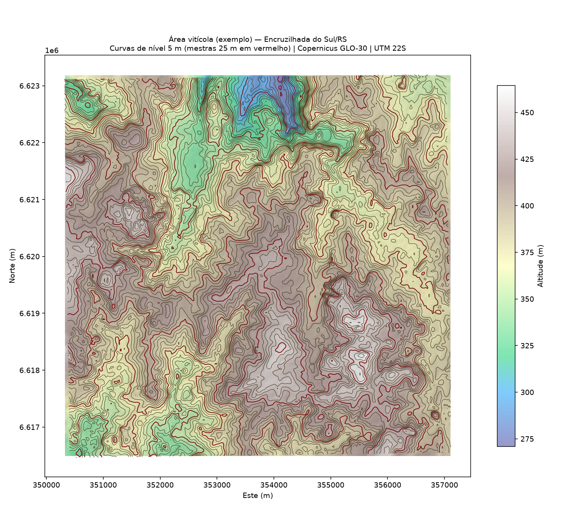

# Curvas de nível — vinhedos de Encruzilhada do Sul / RS

Geração de **curvas de nível**, **declividade** e **relevo sombreado** para a área
vitícola do município de **Encruzilhada do Sul (RS)**, a partir de um Modelo Digital
de Elevação (MDE) de domínio público.

Município de referência: **Encruzilhada do Sul/RS** — código IBGE `4306908`
(Serra do Sudeste / Campanha Gaúcha, região vitivinícola). Altitudes no município:
**~34 m a ~516 m**.



---

## O que tem aqui

```
dados/
  encruzilhada_limite.geojson        limite municipal (IBGE, WGS84)
  area_viticola_bbox.geojson         retângulo da área vitícola de exemplo
  vinhedo_estimado_bbox.geojson      retângulo do vinhedo estimado por aptidão
  lidio_carraro_aprox_bbox.geojson   retângulo do recorte da Lidio Carraro (aprox.)
  dem_encruzilhada_utm22s.tif        MDE recortado no município (UTM 22S, metros)
saida/
  curvas_municipio_20m.geojson/.kml          curvas do município (equidist. 20 m)
  curvas_vinhedo_5m.geojson/.kml             curvas da área vitícola (5 m)
  curvas_vinhedo_estimado_5m.geojson/.kml    curvas do vinhedo estimado (5 m)
  curvas_lidio_carraro_aprox_5m.geojson/.kml curvas da Lidio Carraro (aprox., 5 m)
  mapa_municipio.png                         relevo + curvas (mestras de 100 m)
  mapa_vinhedo_curvas.png                    relevo + curvas de 5 m
  mapa_vinhedo_declividade.png               declividade (classes Embrapa)
  mapa_vinhedo_estimado_curvas.png           relevo + curvas — vinhedo estimado
  mapa_vinhedo_estimado_declividade.png      declividade — vinhedo estimado
  mapa_lidio_carraro_aprox_curvas.png        relevo + curvas — Lidio Carraro (aprox.)
  mapa_lidio_carraro_aprox_declividade.png   declividade — Lidio Carraro (aprox.)
scripts/
  gerar_curvas_nivel.py              CLI reutilizável — aponte para o SEU talhão
  estimar_vinhedo.py                 estipula um vinhedo por aptidão de relevo
  final_lidio.py                     recorte ancorado na Lidio Carraro (aprox.)
  curvas.py / run_all.py             pipeline que reproduz as saídas acima
  baixar_dem.sh                      baixa os tiles do MDE
```

Os arquivos `.kml` abrem direto no **Google Earth**; os `.geojson` e o `.tif`
abrem no **QGIS** (e em GIS web).

---

## Fonte de dados

- **MDE:** [Copernicus GLO-30 DEM](https://registry.opendata.aws/copernicus-dem/)
  (resolução ~30 m), bucket público de open data na AWS
  (`s3://copernicus-dem-30m`), sem autenticação.
- **Limite municipal:** malha de municípios do IBGE (via repositório
  [`tbrugz/geodata-br`](https://github.com/tbrugz/geodata-br)).
- **Sistema de coordenadas dos cálculos:** UTM 22S (`EPSG:32722`), em metros.
- **Declividade:** método de Horn (1981); classes de relevo conforme Embrapa
  (0–3% plano, 3–8% suave-ondulado, 8–13% ondulado, 13–20% ondulado/forte,
  20–45% forte-ondulado, >45% montanhoso).

> ⚠️ **Sobre a "área vitícola de exemplo":** este ambiente de execução não tem
> acesso ao OpenStreetMap/Overpass nem ao geoserviço do IBGE (bloqueados pela
> política de rede), então **não foi possível baixar automaticamente os polígonos
> exatos dos vinhedos mapeados**. A área de exemplo
> (`-52.560, -30.575, -52.490, -30.515`, ~6×7 km de relevo ondulado dentro do
> município) é **representativa**, para demonstrar o método. Para o seu vinhedo
> real, use o CLI abaixo apontando para as coordenadas ou o arquivo do talhão.

---

## Vinhedo mais famoso: Lidio Carraro (localização aproximada)

A vinícola mais famosa do município é a **Lidio Carraro** (Serra do Sudeste;
~230 ha de propriedade, ~48 ha de vinhedos; linha *Faces do Brasil*). As
**coordenadas exatas das parcelas não são públicas**, então o recorte final foi
ancorado na coordenada documentada da **sede de Encruzilhada do Sul** como
referência:

- **Referência:** `30°32'38"S 52°31'19"W` (≈ `-30,5439, -52,5219`), altitude ~432 m
- Janela de 3,5 km · altitude média ~398 m · declividade média ~9,5%
- Gerado por `scripts/final_lidio.py`
- Saídas: `saida/curvas_lidio_carraro_aprox_5m.*` e `mapa_lidio_carraro_aprox_*.png`

> ⚠️ É a **localidade** da vinícola (sede municipal), não o limite exato das
> parcelas. Com o KML/coordenadas reais do talhão, o CLI recorta com precisão.

## Vinhedo estimado por aptidão de relevo

Como não há acesso, neste ambiente, aos polígonos reais dos vinhedos (OSM/IBGE
bloqueados) nem coordenadas públicas das parcelas da Lidio Carraro, o script
`scripts/estimar_vinhedo.py` **estipula** uma localização plausível: varre o MDE
do município em janelas de ~3,5 km e escolhe a que melhor combina **altitude
elevada** e **declividade moderada** (critérios de aptidão vitícola), evitando
áreas muito íngremes. Resultado:

- **Centro estimado:** ~`-30.5593, -52.6676` (lon/lat)
- **Altitude média:** ~412 m · **declividade média:** ~8,2% (suave-ondulado)
- Saídas em `saida/curvas_vinhedo_estimado_5m.*` e `mapa_vinhedo_estimado_*.png`

> ⚠️ É uma **estimativa por relevo**, não a propriedade real. Para o vinhedo
> exato, use o CLI abaixo com as coordenadas/KML do talhão.

## Gerar curvas para o SEU vinhedo

```bash
pip install -r requirements.txt

# (a) por bounding box: minlon minlat maxlon maxlat, curvas de 5 m
python scripts/gerar_curvas_nivel.py \
    --bbox -52.560 -30.575 -52.490 -30.515 -i 5 -o saida_meu_vinhedo

# (b) por arquivo de limite do talhão (.geojson, .kml ou .shp), curvas de 2 m
python scripts/gerar_curvas_nivel.py \
    --limite meu_talhao.geojson -i 2 -o saida_meu_vinhedo
```

O script baixa sozinho os tiles do MDE necessários, reprojeta para UTM,
gera `curvas_nivel.geojson/.kml`, `mapa_curvas.png` e `mapa_declividade.png`.

Parâmetros: `-i/--intervalo` equidistância (m) · `--mestra` intervalo das
curvas mestras · `-o/--out` pasta de saída.

> O MDE tem resolução de ~30 m: curvas de 1–2 m carregam ruído. Para projeto de
> plantio em nível / terraços com precisão, use um levantamento topográfico
> (RTK/drone) e troque o MDE de entrada.

---

## Reproduzir as saídas deste repositório

```bash
pip install -r requirements.txt
bash scripts/baixar_dem.sh          # baixa os tiles para ./dem
python scripts/run_all.py           # regenera tudo em ./saida
```
